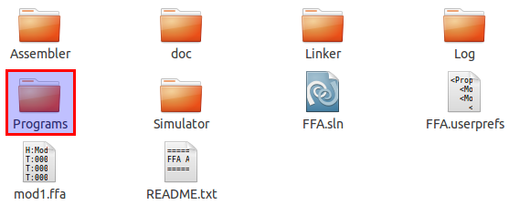
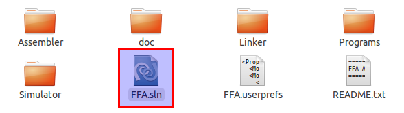
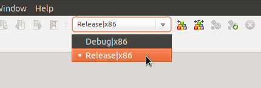
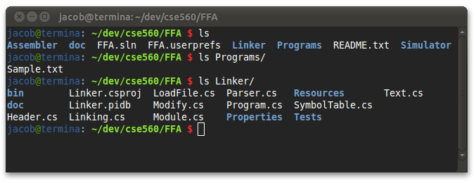
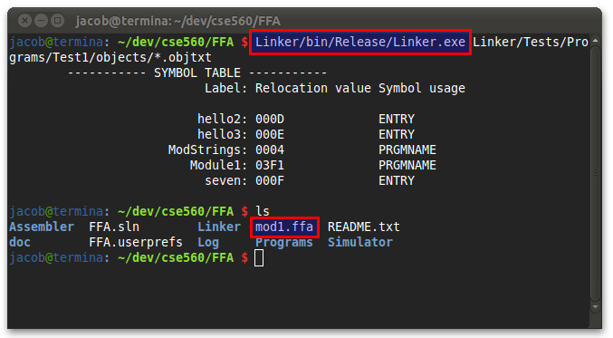

=====================
How to run the Linker
=====================

.. contents::
   :backlinks: none

Moving the files
````````````````

If you are running this program from a CD your files should already be unzipped.  You will need to
move your files off of the CD and on to your computer.  Running it from the CD will cause issues
when the application attempts to write a log file to the disc. Insert
your CD and open it so you are able to view all files on the CD. You should see two items:

* A folder named c560aa05.sp3.early - This contains all of the content for our project including source files and documentation.
* A README.txt - This README will give you a better understanding of the contents of the project. It is no neccessary to correctly run the Linker but may still prove to be useful.

Move the folder off the CD either by clicking on it and dragging or copying then
pasting it somewhere on your computer.  It shouldn't matter where you place the folder, just
as long as it can be found easily.

If you have the zip file already on your computer, you will first need to unzip it using your
computer's default unzipper or another unzipping application.  Once the files are unzipped feel
free to move the folder to a location that is more easily accessible.

Ensuring it will run
````````````````````

In order to run the Linker it is required that the Microsoft .NET Framework 4 or Mono is installed on your machine
depending on the operating system you use.

* In Windows : If you do not already have the Microsoft .NET Framework or if it isn't up to date you will need to download and install the newest version.  Microsoft .NET Framework 4 and be found `on microsoft's website <http://www.microsoft.com/downloads/en/details.aspx?FamilyID=9cfb2d51-5ff4-4491-b0e5-b386f32c0992&displaylang=en#QuickDetails>`_.
* In Mac : The .NET Framework will not work in Mac so you will need Mono which is an open source implementation for compatibility with Microsoft.NET. You can download and install mono `from here <http://www.mono-project.com/Main_Page>`_.
* In Linux : Linux users should be fine as Mono is included with most distributions of Linux.

.. warning::
    Because the Linker and Assembler share some code, Assembler.exe **must be in the same folder** as Linker.exe, otherwise the linker will fail to run.

Create and assemble source
``````````````````````````

Inside the directory from the CD you will find a sample program in the Programs folder. Before passing this program to the linker, you must first assemble it. Please see the `how to for the Assembler <../assembler/how_to.html>`_ for more information.



Compiling the Program
`````````````````````

Your copy of the FFA Linker should include an executable file, however if for some reason you want to rebuild the program using
the provided source code, follow the instructions below. If you plan on using the included executable, please skip this section and
move on to the next secion.

This package includes the source code for the FFA Linker. Most of the files required are located in the Linker directory.

To compile this using `Visual Studio <http://www.microsoft.com/visualstudio/en-us/home>`_:
Note: Visual Studio must be installed on your machine to do this.



Double click on FFA.sln.  This is the project file and will open all associated files in Visual Studio for you.
At the top of the window there is a dropdown box that will say Debug by default. You chould change this to Release before
building. The Debug version of this program includes extra output which isn't very useful for general use.



Now go to the Build menu at the top and select Build Solution or press Control + Shift + B. This will create the executable
file in Linker/bin/Release/. To use this as described below, you can move Linker.exe into the Linker directive
(Linker/bin/Release/Linker.exe to Linker/Linker.exe).

Alternatively, advanced users may compile via the command-line. To do this, run ``msbuild`` (Windows) or ``xbuild`` (Linux) from the same directory as FFA.sln. The executable will be created in the same location as above.

Opening the Terminal
````````````````````

The easiest way to run the Linker is from the command line.  You will need to open a command
prompt.

* In Windows : Open the start menu and type cmd in the search bar. Press enter or select cmd.exe from the results.
* In Unix : Open the terminal from your launcher or by going to Applications > Accessories > Terminal.
* In Mac: Launch Applications or Finder then locate Terminal.

Now navigate to the c560aa05.sp3.early folder located on your computer through the terminal.
By typing ``cd <dir>`` and by replacing <dir> with the directory you want,
you can move into a new directory.  For example, if you are currently in /MyHome/ and you
want to move to /MyHome/Programs/c560aa05.sp3.early, you can type::

	cd Programs/c560aa05.sp3.early/

and hit enter.  To move back a directory you can type ``cd ..`` which will
move you to the directory directly above you.

You can also display all of the contents in your current directory to help you navigate.

* Windows: Use the command "dir".
* Unix/Mac: Use the command "ls".



Once you are in the c560aa05.sp3.early folder you can run the Linker.

Running the Linker
``````````````````

Run the Linker using the command::

	Linker.exe file1.obj [file2.obj [file3.obj [...]]]

where ``file1.obj``, ``file2.obj``, (etc) are the names of assembled object files to link together. At least one file must be specified, but any number of files may be linked together as long as it will fit into memory in the end. A ``.ffa`` file with the same base name as the first object file given will be created with the resulting load file.

For example, if you assembled the sample program given in the Programs folder, you will have ended up with a file called ``Sample.obj``. This could be linked on its own::

    Linker.exe Sample.obj

The linker will then output ``Sample.ffa`` which could then be run by the Simulator. (For information on running programs with the simulator, see the `Simulator How To <../simulator/how_to.html>`_.)

The linker will also output a symbol table containg a list of linked and relocated symbols to the screen.
Please see the `User's Guide <user_guide.html>`_ for more information on this output.

Some examples of how you may run this program::
 
	Linker.exe mod1.obj strings.obj
	
	Linker.exe single.obj
	
	Linker.exe part1.obj part2.obj part3.obj part4.obj
	
	


Further Reading
```````````````

For more information on running programs with the linker, check out the `User Guide <user_guide.html>`_.

