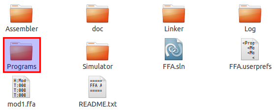
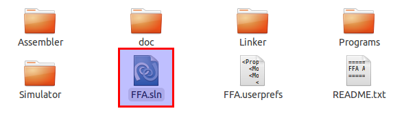
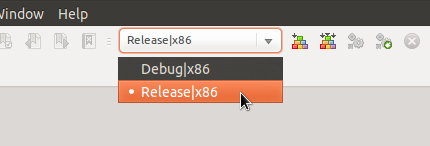
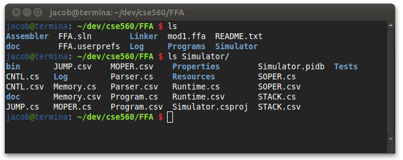
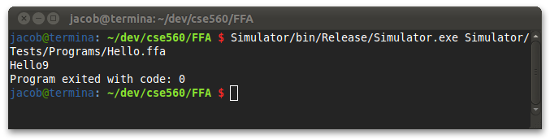
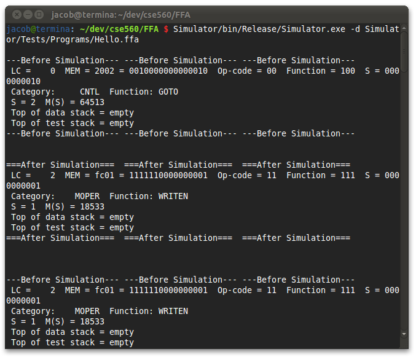

========================
How to run the Simulator
========================

.. contents::
   :backlinks: none

Moving the files
````````````````

If you are running this program from a CD your files should already be unzipped.  You will need to
move your files off of the CD and on to your computer.  Running it from the CD will cause issues
when the application attempts to write a log file to the disc. Insert
your CD and open it so you are able to view all files on the CD. You should see two items:

* A folder named c560aa05.sp4.early - This contains all of the content for our project including source files and documentation.
* A README.txt - This README will give you a better understanding of the contents of the project. It is no neccessary to correctly run the Simulator but may still prove to be useful.

Move the folder off the CD either by clicking on it and dragging or copying then
pasting it somewhere on your computer.  It shouldn't matter where you place the folder, just
as long as it can be found easily.

If you have the zip file already on your computer, you will first need to unzip it using your
computer's default unzipper or another unzipping application.  Once the files are unzipped feel
free to move the folder to a location that is more easily accessible.

Ensuring it will run
````````````````````

In order to run the Simulator it is required that the Microsoft .NET Framework 4 or Mono is installed on your machine
depending on the operating system you use.

* In Windows : If you do not already have the Microsoft .NET Framework or if it isn't up to date you will need to download and install the newest version.  Microsoft .NET Framework 4 and be found `on microsoft's website <http://www.microsoft.com/downloads/en/details.aspx?FamilyID=9cfb2d51-5ff4-4491-b0e5-b386f32c0992&displaylang=en#QuickDetails>`_.
* In Mac : The .NET Framework will not work in Mac so you will need Mono which is an open source implementation for compatibility with Microsoft.NET. You can download and install mono `from here <http://www.mono-project.com/Main_Page>`_.
* In Linux : Linux users should be fine as Mono is included with most distributions of Linux.

.. warning::
    Because the Simulator and Assembler share some code, Assembler.exe **must be in the same folder** as Simulator.exe, otherwise the simulator will fail to run.

Create, assemble, and link source
`````````````````````````````````

Inside the directory from the CD you will find a sample program in the Programs folder. Before passing this program to the simulator, you must first assemble and link it. Please see the `how to for the Assembler <../assembler/how_to.html>`_ for more information on assembling the program. Then, look at the `how to for the Linker <../linker/how_to.html>`_ to see how to link the program.



Compiling the Program
`````````````````````

Your copy of the FFA Simulator should include an executable file, however if for some reason you want to rebuild the program using
the provided source code, follow the instructions below. If you plan on using the included executable, please skip this section and
move on to the next secion.

This package includes the source code for the FFA Simulator. Most of the files required are located in the Simulator directory.

To compile this using `Visual Studio <http://www.microsoft.com/visualstudio/en-us/home>`_:
Note: Visual Studio must be installed on your machine to do this.



Double click on FFA.sln.  This is the project file and will open all associated files in Visual Studio for you.
At the top of the window there is a dropdown box that will say Debug by default. You chould change this to Release before
building. The Debug version of this program includes extra output which isn't very useful for general use.



Now go to the Build menu at the top and select Build Solution or press Control + Shift + B. This will create the executable
file in Simulator/bin/Release/. To use this as described below, you can move Simulator.exe into the Simulator directive
(Simulator/bin/Release/Simulator.exe to Simulator/Simulator.exe).

Alternatively, advanced users may compile via the command-line. To do this, run ``msbuild`` (Windows) or ``xbuild`` (Linux) from the same directory as FFA.sln. The executable will be created in the same location as above.

Opening the Terminal
````````````````````

The easiest way to run the Simulator is from the command line.  You will need to open a command
prompt.

* In Windows : Open the start menu and type cmd in the search bar. Press enter or select cmd.exe from the results.
* In Unix : Open the terminal from your launcher or by going to Applications > Accessories > Terminal.
* In Mac: Launch Applications or Finder then locate Terminal.

Now navigate to the c560aa05.sp4.early folder located on your computer through the terminal.
By typing ``cd <dir>`` and by replacing <dir> with the directory you want,
you can move into a new directory.  For example, if you are currently in /MyHome/ and you
want to move to /MyHome/Programs/c560aa05.sp4.early, you can type::

	cd Programs/c560aa05.sp4.early/

and hit enter.  To move back a directory you can type ``cd ..`` which will
move you to the directory directly above you.

You can also display all of the contents in your current directory to help you navigate.

* Windows: Use the command "dir".
* Unix/Mac: Use the command "ls".



Once you are in the c560aa05.sp4.early folder you can run the Simulator.

Running the Simluator
`````````````````````

Run the Simulator using the command::

	Simulator.exe module.ffa

Where ``module.ffa`` is the name of the assembled and linked file to run in the simulation. This ``.ffa`` file is obtained as output from the linker; for information on linking files please see the `Linker How To <../linker/how_to.html>`_.

For example, if you linked the Sample program used in the Linker and Assembler how to guides, you would have a ``Sample.ffa`` file to run::

    Simulator.exe Sample.ffa

The simulator will then load the program, check for and display any errors, and then output the results to the screen, along with the running program's exit code.



Debug Mode
~~~~~~~~~~

To see extensive output from the simulator, you may pass the ``-d`` switch to turn on debug mode. Debug mode will show you the contents of memory and stacks **before** and **after** each line of code is executed::

    Simulator.exe -d module.ffa



Further Reading
```````````````

For more information on running programs with the simulator, check out the `User Guide <user_guide.html>`_.

