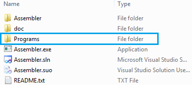
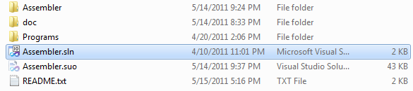
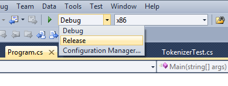
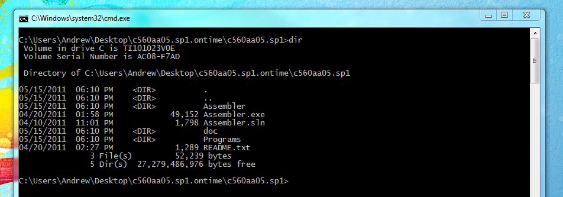
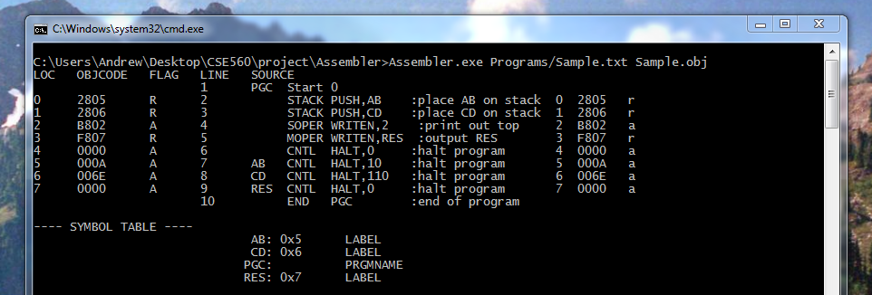

How to run the Assembler
------------------------

.. contents::
   :backlinks: none

1) Moving the files
```````````````````

If you are running this program from a CD your files should already be unzipped.  You will need to
move your files off of the CD and on to your computer.  Running it from the CD will cause issues
when the application attempts to write a log file to the disc. Insert
your CD and open it so you are able to view all files on the CD. You should see two items:

* A folder named c560aa05.sp2.early - This contains all of the content for our project including source files and documentation.
* A README.txt - This README will give you a better understanding of the contents of the project. It is no neccessary to correctly run the Assembler but may still prove to be useful.

Move the folder off the CD either by clicking on it and dragging or copying then
pasting it somewhere on your computer.  It shouldn't matter where you place the folder, just
as long as it can be found easily.

If you have the zip file already on your computer, you will first need to unzip it using your
computer's default unzipper or another unzipping application.  Once the files are unzipped feel
free to move the folder to a location that is more easily accessible.

2) Ensuring it will run
```````````````````````

In order to run the Asembler it is required that the Microsoft .NET Framework 4 or Mono is installed on your machine
depending on the operating system you use.

* In Windows : If you do not already have the Microsoft .NET Framework or if it isn't up to date you will need to download and install the newest version.  Microsoft .NET Framework 4 and be found `on microsoft's website <http://www.microsoft.com/downloads/en/details.aspx?FamilyID=9cfb2d51-5ff4-4491-b0e5-b386f32c0992&displaylang=en#QuickDetails>`_.
* In Mac : The .NET Framework will not work in Mac so you will need Mono which is an open source implementation for compatibility with Microsoft.NET. You can download and install mono `from here <http://www.mono-project.com/Main_Page>`_.
* In Linux : Linux users should be fine as mono is included with most distributions of Linux.

3) Creating a source file
`````````````````````````

You will need a program written in FFA to be compiled by this application. The language
specification is given `here <language_spec.html>`_.  We also have a few example programs in our `testing plan <test_plan.html#sample-test-programs>`_. Your program
should be written in an ASCII text file.

Below is another example of a FFA program called Sample.txt::

    PGC  Start 0
         STACK PUSH,AB    :place AB on stack  0  2805   r
         STACK PUSH,CD    :place CD on stack  1  2806   r
         SOPER WRITEN,2    :print out top     2  B802   a  
         MOPER WRITEN,RES  :output RES        3  F807   r  
         CNTL  HALT,0     :halt program       4  0000   a
    AB   CNTL  HALT,10    :halt program       5  000A   a
    CD   CNTL  HALT,110   :halt program       6  006E   a
    RES  CNTL  HALT,0     :halt program       7  0000   a
         END   PGC        :end of program 

In the comments of this program it explains what each line is supposed to do, followed by the line nymber,
the translated hex code and last the flag set by the assembler for the linker (you don't need to worry about
these).

Inside the c560aa05.sp2.early directory you will also find a folder called "Programs". Either move or copy your FFA program into
the Programs folder. While not necessary to keep your programs here in order to use the Assembler, it is provided for convenience
and will be assumed to be the location of your programs for the rest of this guide.



4) Compiling the Program
````````````````````````

Your copy of the FFA Assembler should include an executable file, however if for some reason you want to rebuild the program using
the provided source code, follow the instructions below. If you plan on using the included executable, please skip this section and
move on to part 5, opening the terminal.

This package includes the source code for the FFA Assembler. Most of the files required are located in the Assembler directory.

To compile this using `Visual Studio <http://www.microsoft.com/visualstudio/en-us/home>`_:
Note: Visual Studio must be installed on your machine to do this.



Double click on Assembler.sln.  This is the project file and will open all associated files in Visual Studio for you.
At the top of the window there is a dropdown box that will say Debug by default. You chould change this to Release before
building. The Debug version of this program includes extra output which isn't very useful for general use.



Now go to the Build menu at the top and select Build Solution or press Control + Shift + B. This will create the executable
file in Assembler/bin/Release/. To use this as described below, you can move Assembler.exe into the Assembler directive
(Assembler/bin/Release/Assembler.exe to Assembler/Assembler.exe).

Alternatively, advanced users may compile via the command-line. To do this, run ``msbuild`` (Windows) or ``xbuild`` (Linux) from the same directory as Assembler.sln. The executable will be created in the same location as above.

5) Opening the Terminal
```````````````````````

The easiest way to run the Assembler is from the command line.  You will need to open a command
prompt.

* In Windows : Open the start menu and type cmd in the search bar. Press enter or select cmd.exe from the results.
* In Unix : Open the terminal from your launcher or by going to Applications > Accessories > Terminal.
* In Mac: Launch Applications or Finder then locate Terminal.

Now navigate to the c560aa05.sp2.early folder located on your computer through the terminal.
By typing "cd <dir>" without the quotes and by replacing <dir> with the directory you want,
you can move into a new directory.  For example, if you are currently in /MyHome/ and you
want to move to /MyHome/Programs/c560aa05.sp2.early you can type::

	cd Programs/c560aa05.sp2.early/

and hit enter.  To move back a directory you can type "cd .." without the quotes. This will
move you to the directory directly above you.

You can also display all of the contents in your current directory to help you navigate.

* Windows: Use the command "dir".
* Unix/Mac: Use the command "ls".



Once you are in the c560aa05.sp2.early folder you can run the Assembler.

6) Running the Assembler
````````````````````````

Run the Assembler using the command::

	Assembler.exe <inputfile> <outputfile>

where input file is the name of your program that you wish to compile and outputfile is the name
of the file you wish to save the object file in. Providing an outputfile name is optional. If no 
outputfile name is given then the Assembler will name the objectfile after your inputfile with .obj
added to the end.

The Assembler will also produce an assembly report which will be displayed to the screen by default.
Please see the `User's Guide <user_guide.html>`_ for more information on this output.

You can store this output in a file by adding "> <outputfile>" to the command above.

Some examples of how you may run this program::
 
	Assembler.exe Programs/PRGM1.txt PRGM.obj
	
	Assembler.exe Programs/PRGM2.txt PRGM2.obj > PRGM2output.txt
	
	Assembler.exe Programs/Sample.txt
	
	



Instructions on how to link and run the FFA program will be available with the release of our linker and
simulator.
